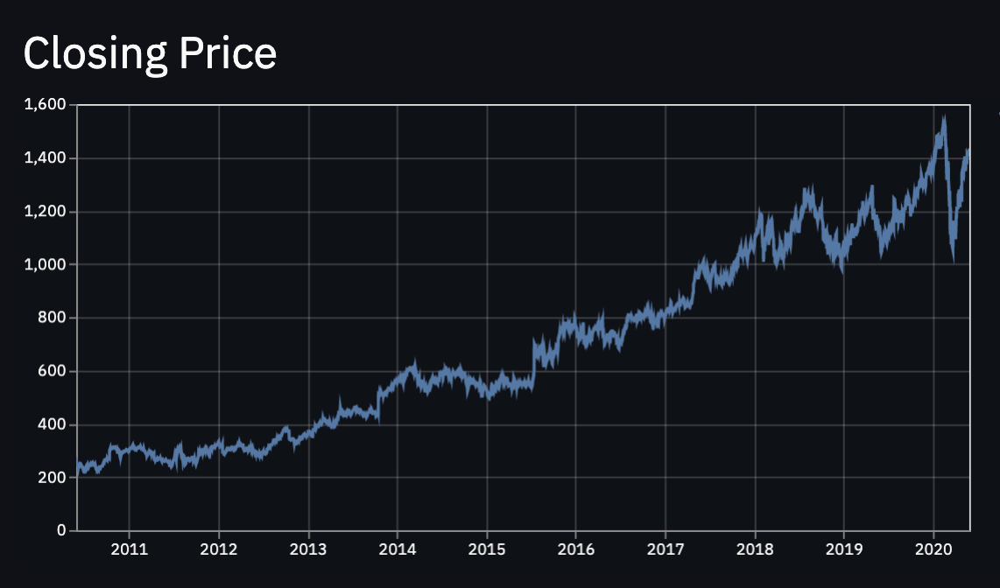
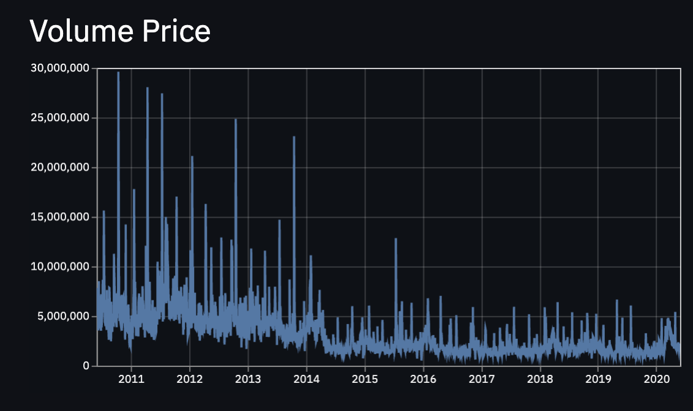

## Google Stock Price
# Simple Stock Price App
* Shown are the stock **closing price** and ***volume*** of Google!

* feat create a simple stock price app, to studie data science.
> Exercises to: https://youtu.be/JwSS70SZdyM 

> https://towardsdatascience.com/how-to-get-stock-data-using-python-c0de1df17e75

* Closing Price:

* Volume Price:

# Streamlit on Docker
## Run Streamlit
### Run the app script

Run `docker-compose up` to run `src/app.py` in Streamlit.

then open [localhost:8501/?name=app](http://localhost:8501/?name=app) in your browser. 